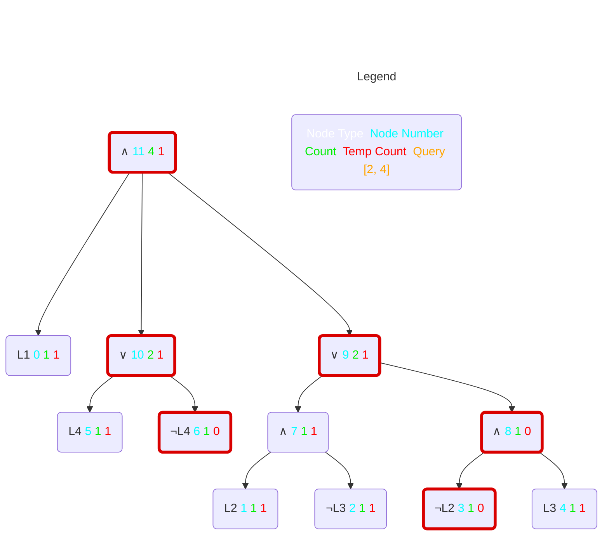

# ddnnife

> A d-DNNF reasoner.

`ddnnife` takes a smooth d-DNNF following the standard format specified by [c2d][c2d] or the [d4][d4] standard (an extension of the c2d standard).
After parsing and storing, `ddnnife` can be used to compute the cardinality of single features, all features, or partial configurations.
Additionally, via the stream API, it can compute SAT queries, core/dead features, atomic sets, enumerate complete valid configurations, and produce uniform random samples. 

# Table of contents

1. [Building](#building)
   - [Requirements](#requirements)
   - [Build](#build)
   - [Tests](#tests)
2. [Usage](#usage)
   - [CLI](#cli)
   - [Stream API](#stream-api)
   - [Documentation](#documentation)
3. [Container](#container)

# Installation

## Pre-built

You can use pre-built binaries for Linux, macOS or Windows.
There are two flavours for each target, one with the d4 compiler included and one without.
Builds for the latest release are attached as assets for each [release][releases].

Using the variant without d4 is straight forward, there are no external dependencies.
The variant with d4 has some dynamic dependencies which need to be set up.
Please see the README inside the release folder for details.

On (Linux) systems with an older glibc, the d4 variant might not work.
In this case, there is also the portable variant which is a self-extracting archive with everything bundled in one binary.

### Nix

This project can be used and developed via a [Nix][nix] [flake][flake].

With Nix installed simply run the following for a build:

```
nix build
```

The result will be at `result`.

To build without the need to clone the repository, use:

```
nix build github:SoftVarE-Group/d-dnnf-reasoner
```

The default package output (`ddnnife-d4`) includes `d4`.
To build the variant without `d4` use the package `ddnnife`:

```
nix build .#ddnnife
```

## Container

There is also a container image for usage with [Docker][docker], [Podman][podman] or any other container tool.

For an overview, see [here][container].

There is a tag for each branch and for each tagged release.
Currently, the latest version is found on the `main` branch.
To pull the container, use:

```
docker pull ghcr.io/softvare-group/ddnnife:main
```

Then, you can use it like the standalone binary.
For `ddnnife` to be able to access files, you need to create a volume.
The following mounts `<local/directory>` on `/work` inside the container:

```
docker run -v <local/directory>:/work ddnnife:main /work/<file.ddnnf> count
```

# Building

## Requirements

- [Rust][rust]
- [Boost][boost]
- [GMP][gmp] (with C++ bindings)
- [Mt-KaHyPar][mtkahypar] (optional, required for including d4)
- GCC or Clang

### Linux

- diffutils
- m4
- make

### macOS

The commandline developer tools have to be present:

```
xcode-select --install
```

### Windows

On Windows, [MSYS2][msys2] is required to build the project.
The UCRT64 or CLANG64 environment is used depending on the compiler (GCC or Clang).
All dependencies must be installed for the environment.
This can be achieved by using `pacboy`:

```
pacman -S pactoys
pacboy -S toolchain:p boost:p
```

Mt-KaHyPar has to be present in the MSYS2 environment as well when building with d4.

## Build

There are two flavours of ddnnife:
One with the [d4][d4] compiler built in and one without.
Whether d4 is included depends on the `d4` feature flag passed to cargo.

When building with cargo, the resulting binaries will be at `target/release/{ddnnife, dhone}`.

### With default features (without d4)

```
cargo build --release
```

### With d4

```
cargo build --release --features d4
```

### dhone (dsharp preprocessor)

```
cargo build --release --bin dhone
```

## Tests

### Running

We highly encourage running test cases with the release build, as the debug build is very slow in comparison.

```
cargo test --release
```

### Coverage

Test coverage can be determined with [`llvm-cov`][llvm-cov].
It is not included with `rustup` and has to be installed separately, please see its installation instructions.

```
cargo llvm-cov --release --open
```

`--open` will open the report in the browser instead of the console (the default).

# Usage

## CLI


Both `ddnnife` and `dhone` provide a help information via `--help`.
Simply execute the binaries with the -h, --help flag or no parameter at all to get an overview of all possible parameters and how to use them.

### Examples

The following examples assume `ddnnife` and `dhone` to be present in the path.
This could be achieved by modifying `$PATH` on unix system for example.

Prepossesses the d-DNNF: `berkeleydb_dsharp.nnf` which may need preprocessing because it was created with dsharp (in this case it is necessary) and save the resulting d-DNNF as `berkeleydb_prepo.nnf`.

```
ddnnife example_input/berkeleydb_dsharp.nnf -s example_input/berkeleydb_prepo.nnf
```

Compute the cardinality of a feature model for `auto1`.

```
ddnnife example_input/auto1_c2d.nnf
```

Compute the cardinality of features for `busybox-1.18.0_c2d.nnf` and saves the result as `busybox-features.csv` in the current working directory.

```
ddnnife example_input/busybox-1.18.0_c2d.nnf -c busybox
```

Compute the cardinality of features for `auto1` when compiled with d4.
Here we need the `-t` option that allows us to specify the total number of features.
That information is needed but not contained in d-DNNFs using the d4 standard.
Furthermore, the parsing takes more time because we have to smooth the d-DNNF.
The results will be saved as `auto1_d4_2513-features.csv`.
(Note that for the example input the number of features is part of the file name for d4 models.)

```
ddnnife example_input/auto1_d4_2513.nnf -t 2513 -c
```

Compute the cardinality of features for `auto1` starting from a CNF file.
Currently, the CNF file must be indicated by either the file ending `.cnf` or `.dimacs`.
We use the d4 compiler to generate a dDNNF which we can use in the following steps.
The `-t` option is not necessary, because the needed information if part of the CNF.

```
ddnnife example_input/auto1.cnf -c
```

An alternative to the above, using the possibility to load a model via stdin.

```
cat example_input/auto1_d4_2513.nnf | ddnnife -p -t 2513 -c
```

Compute the cardinality of partial configurations for `X264_c2d.nnf` with 4 threads (default) and save the result as `X264_c2d-queries.csv` (default) in the current working directory (default).

```
ddnnife example_input/X264_c2d.nnf -q example_input/X264.config
```

Compute 100 uniform random samples for the auto1 model for seed 42.

```
ddnnife example_input/auto1_d4.nnf -t 2513 urs -n 100 -s 42
```

Compute the atomic sets for auto1.

```
ddnnife example_input/auto1_d4.nnf -t 2513 atomic-sets
```

Display the help information for the sat command.

```
ddnnife sat -h
```

Create the mermaid visualization of the small example d-DNNF under assumptions.
The model count is 4 and the count for the partial configuration (2,4) is 1.

```
ddnnife example_input/small_example_c2d.nnf mermaid -a 2 4 
```



## Stream API

With the `stream` command, we introduce the possibility to interact with ddnnife via stdin and stdout.
The user can choose between different kinds of queries that can be further adjusted with additional parameters.
The idea behind the stream API is to interact with `ddnnife` with another program, but for testing purposes, one can use the stdin and stdout of a terminal to test the API.

We start ddnnife in stream mode for the `automotive01` model via

```
ddnnife example_input/auto1_d4.nnf -t 2513 stream
```

From here on, we can use the following types of queries:

- `count`: Computes the cardinality of a partial configuration
- `core`: Lists core and dead features
- `sat`: Computes if a partial configuration is satisfiable
- `enum`: Lists complete satisfiable configurations
- `random`: Gives uniform random samples (which are complete and satisfiable)
- `atomic`: Computes atomic sets
- `atomic-cross`: Computes atomic sets; a set can contain included and excluded features
- `clause-update`: Manipulates the underlying CNF by adding / removing clauses and adjusting the total amount of features. Requires any change to be valid.
- `undo-update`: Reverting the latest manipulation. Applying ```undo-update``` twice results in the second ```undo-update``` being equivalent to a redo.
- `save-ddnnf`: Saves the d-DNNF for future use.
- `save-cnf`: Saves the d-DNNF as CNF for future use; does require the input to be a CNF as well. Saving always persists the current version. Hence, this is especially intersting in combination with ```clause-update```.
- `exit`: Leaves the stream mode

Furthermore, where sensible, the types of queries can be combined with the parameters:

- `v variables`: The features we are interested in
- `a assumptions`: Assignments of features to true or false
- `l limit`: The number of solutions
- `s seed`: Seeding for random operations
- `p path`: The absolute path, for when we want to save the d-DNNF as d-DNNF or CNF.
- `add`: Add something; currently only available for clauses
- `rmv`: Remove something; currently only available for clauses
- `t total-features`: Change the total amount of features. `t total-features` is always evaluated before `add` and `rmv`.

The table below depicts the possible combinations of a query type with the parameters. The order of parameters does NOT influence the result and if two or more parameters are valid, then every possible combination of those is also valid.
Some parameters are optional and others are required. The usage should be intuitive. Otherwise, one can try and get an error message explaining what went wrong. The examples listed later serve as a guide.

| query type / parameter | variables | assumptions | limit | seed | path | add | rmv | total-features |
|------------------------|-----------|-------------|-------|------|------|-----|-----|----------------|
| count                  |     ✔     |      ✔      |       |      |      |     |     |                |
| core                   |     ✔     |      ✔      |       |      |      |     |     |                |
| sat                    |     ✔     |      ✔      |       |      |      |     |     |                |
| enum                   |           |      ✔      |   ✔   |   ✔  |      |     |     |                |
| random                 |           |      ✔      |   ✔   |   ✔  |      |     |     |                |
| atomic                 |     ✔     |      ✔      |       |      |      |     |     |                |
| atomic-cross           |     ✔     |      ✔      |       |      |      |     |     |                |
| clause-update          |           |             |       |      |      |  ✔  |  ✔  |       ✔        |
| undo-update            |           |             |       |      |      |     |     |                |
| save-ddnnf             |           |             |       |      |   ✔  |     |     |                |
| save-cnf               |           |             |       |      |   ✔  |     |     |                |
| exit                   |           |             |       |      |      |     |     |                |

Sub-solutions (like multiple uniform random samples) will be separated by `;`.
Intern a solution, the feature numbers are separated by a space. The end of an answer is indicated by a new line.

Syntactically wrong queries will result in an error message with an error code.
The different error codes are: 

- `E1` Operation is not yet supported
- `E2` Operation does not exist. Neither now nor in the future
- `E3` Parse error
- `E4` Syntax error
- `E5` Operation was not able to be done, because of the wrong input
- `E6` File or path error

### Examples

After entering the stream API, the following examples are conceivable but not exhaustive:

Check whether features 10, 100, and 1000 are either core or dead under the assumption that feature 1 is deselected.

```
core a -1 v 10 100 1000
```

Compute the cardinality of partial configuration for the configurations: `[1, -4, -5, -6]`, `[2, -4, -5, -6]`, and `[3, -4, -5, -6]`.

```
count v 1 2 3 a -4 -5 -6
```

Similarly to count, we compute whether the partial configuration is satisfiable: `[1, -4, -5, -6]`, `[2, -4, -5, -6]`, and `[3, -4, -5, -6]`.

```
sat v 1 2 3 a -4 -5 -6
```

Lists all possible complete and valid configurations, with feature 1 selected and feature 2 deselected, as long as there are some left.
Each following call will result in configurations that were not yet computed as results.
After all configurations were returned as a result, we start again at the beginning.

```
enum l 10 a 1 -2
```

Creates 10 uniform random samples with the seed 42.
If neither ```l``` nor ```s``` is set, one uniform random sample will be created.

```
random l 1 s 42
```

Computes all atomic sets for the candidates ```v``` under the assumptions ```a```.
If no candidates are supplied, all features of the d-DNNF will be the candidates.

```
atomic v 1 2 3 4 5 6 7 8 9 10 a 1
```

Adds two new features and a clause enforcing either on of the two new features to be selected.

```
clause-update t 44 add 43 44
```

Saves the nnf as smooth d-DNNF in the c2d format. The parameter `p` or `path` has to be set, and the path must be absolute.

```
save-ddnnf p /path/to/d-DNNFs/auto1.nnf
```

## Documentation

To generate an HTML documentation of the code and open it in the default browser, use:

```
cargo doc --open
```

[releases]: https://github.com/SoftVarE-Group/d-dnnf-reasoner/releases
[c2d]: http://reasoning.cs.ucla.edu/c2d
[d4]: https://github.com/SoftVarE-Group/d4v2
[rust]: https://rust-lang.org
[boost]: https://boost.org
[gmp]: https://gmplib.org
[mtkahypar]: https://github.com/kahypar/mt-kahypar
[msys2]: https://msys2.org
[llvm-cov]: https://github.com/taiki-e/cargo-llvm-cov
[nix]: https://nixos.org
[flake]: https://nixos.wiki/wiki/Flakes
[docker]: https://docker.com
[podman]: https://podman.io
[container]: https://github.com/SoftVarE-Group/d-dnnf-reasoner/pkgs/container/ddnnife
