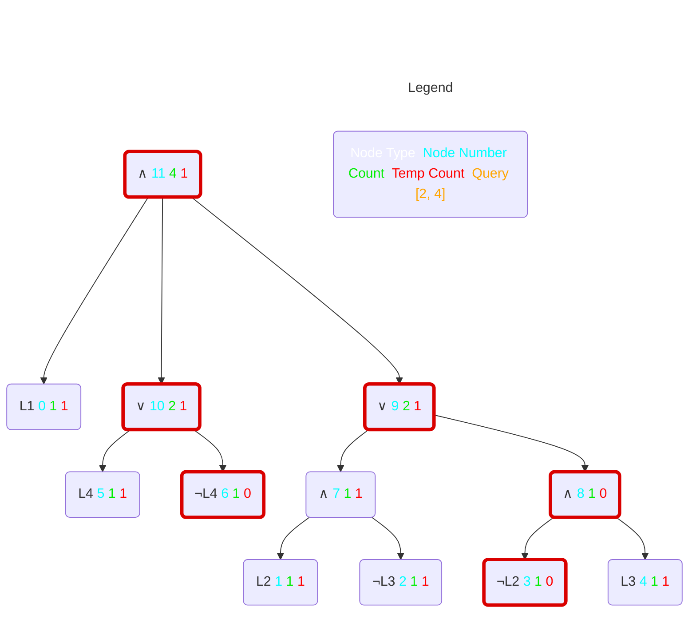

# ddnnife a d-dnnf-reasoner

ddnnife takes a smooth d-DNNF as input following the [standard format specified by c2d](http://reasoning.cs.ucla.edu/c2d/). After parsing and storing the d-DNNF, ddnnife can be used to compute the cardinality of single features, all features, or partial configurations. Beside that, ddnnife offers multiple additional features.

# Table of contents
1. [Building ](#building)
   - [Requirements for Building ](#building_req)
   - [Build the Binaries ](#building_bin)
     - [Both ](#building_both)
     - [ddnnife ](#building_ddnnife)
     - [dhone (dsharp preprocessor) ](#building_dhone)
2. [Usage ](#usage)
   - [Binary on the Command Line ](#usage_cl)
     - [Examples ](#usage_cl_ex)
   - [Stream API ](#building_stream)
     - [Examples ](#building_stream_ex)
   - [Create Documentation ](#docu)
   - [Run Tests ](#tests)
   - [Test Coverage ](#coverage)

# Building <a name="building"></a>
In the following, we describe the process to compile ddnnife. As an alternative, we offer binaries of the major releases on the main branch.

## Requirements for Building <a name="building_req"></a>

First, if not done already, you have to [install rust](https://www.rust-lang.org/tools/install). The recommended way is the following, using curl and rustup:
```properties
curl --proto '=https' --tlsv1.2 -sSf https://sh.rustup.rs | sh
```
After that, we recommend entering "1" to proceed with installation (without customizations).

Additionally, we use rug for the computations. Make sure to install everything mentioned on rugs [crates.io page](https://crates.io/crates/rug) to use rug and our software. There it says:

*Rug [...] depends on the [GMP](https://gmplib.org/), [MPFR](https://www.mpfr.org/) and [MPC](https://www.multiprecision.org/mpc/) libraries through the low-level FFI bindings in the [gmp-mpfr-sys crate](https://crates.io/crates/gmp-mpfr-sys), which needs some setup to build; the [gmp-mpfr-sys documentation](https://docs.rs/gmp-mpfr-sys/1.4.7/gmp_mpfr_sys/index.html) has some details on usage under [different os][...].*

To build on GNU/Linux, make sure you have ```diffutils, ggc, m4``` and ```make``` installed on your system. For example on Ubuntu:
```properties
sudo apt-get update && apt-get install diffutils gcc m4 make
```

## Build the Binaries <a name="building_bin"></a>

Make sure that the current working directory is the one including the Cargo.toml file.

### Both <a name="building_both"></a>
```properties
cargo build --release
```

### ddnnife <a name="building_ddnnife"></a>
```properties
cargo build --release --bin ddnnife
```

### dhone (dsharp preprocessor) <a name="building_dhone"></a>
```properties
cargo build --release --bin dhone
```

# Usage <a name="usage"></a>
## Binary on the Command Line <a name="usage_cl"></a>
Simply execute the binaries with the -h, --help flag or no parameter at all to get an overview over all possible paramters and how to use them.

Note: In this and the following code examples, we added the ```./target/release/``` directories as prefix because that's where the binaries are placed when building. They are built according to the previous chapter and the working directory is not switched.

Help for dhone
```properties
./target/release/dhone -h
```

and ddnnife
```properties
./target/release/ddnnife -h
```

### Examples <a name="usage_cl_ex"></a>
Preprocesses the d-DNNF: ```berkeleydb_dsharp.dimacs.nnf``` which may need preprocessing because it was created with dsharp (in this case it is actually necessary) and save the resulting d-DNNF as ```berkeleydb_prepo.dimacs.nnf```
```properties
./target/release/dhone example_input/berkeleydb_dsharp.dimacs.nnf -s example_input/berkeleydb_prepo.dimacs.nnf
```
Compute the cardinality of a feature model for ```automotive01```.
```properties
./target/release/ddnnife example_input/automotive01.dimacs.nnf
```

Compute the cardinality of features for ```busybox-1.18.0.dimacs.nnf``` with 2 threads and save the result as ```busybox-features.csv``` in the current working directory.
```properties
./target/release/ddnnife example_input/busybox-1.18.0.dimacs.nnf -c busybox -j 2
```

Compute the cardinality of features for ```automotive01``` when compiled with d4. Here we need the ```-o``` Option that allows us to specify the total number of features. That information is needed but not contained in d-DNNFs using the d4 standard. Furthermore, the parsing takes more time because we have to smooth the d-DNNF. The results will be saved as ```auto1_d4-features.csv```.
```properties
./target/release/ddnnife example_input/auto1_d4.nnf -o 2513 -c
```

An alternative to the above, using the possibility to load a model via stdin.
```properties
cat example_input/auto1_d4.nnf | ./target/release/ddnnife -p -o 2513 -c
```

Compute the cardinality of partial configurations for ```X264.dimacs.nnf``` with 4 threads (default) and save the result as ```X264.dimacs-queries.txt"```(default) in the current working directory (default).
```properties
./target/release/ddnnife example_input/X264.dimacs.nnf -q example_input/X264.config
```

Compute 100 uniform random samples for the auto1 model for the seed 42.
```properties
./target/release/ddnnife example_input/auto1_d4.nnf -o 2513 urs -n 100 -s 42
```

Compute the atomic sets for auto1.
```properties
./target/release/ddnnife example_input/auto1_d4.nnf -o 2513 atomic-sets
```

Display the help information for the sat command.
```properties
./target/release/ddnnife sat -h
```

Create the mermaid visualization of the small example dDNNF under assumptions. The model count is 4 and the count for the partial configuration (2,4) is 1.
```properties
./target/debug/ddnnife example_input/small_example_c2d.nnf mermaid -a 2 4 
```



## Stream API <a name="building_stream"></a>
With the ```stream``` command, we introduce the possibility to interact with ddnnife via stdin and stdout. The user can choose between different kinds of queries that can be further adjusted with additional parameters. The idea behind the stream API is to interact with ddnnife with another program, but for testing purposes one can use the stdin and stdout of a terminal to test the API.

We start ddnnife in stream mode for the ```automotive01``` model via
```properties
./target/release/ddnnife example_input/auto1_d4.nnf -o 2513 stream
```

From here on, we can use the following types of queries:
- ```count```: computes the cardinality of a partial configuration
- ```core```: lists core and dead features
- ```sat```: computes if a partial configuration is satisfiable
- ```enum```: lists complete satisfiable configurations
- ```random```: gives uniform random samples (which are complete and satisfiable)
- ```atomic```: computes atomic sets
- ```save```: saves the d-DNNF for future use
- ```exit```: leaves the stream mode

Furthermore, where sensible, the types of queries can be combined with the parameters:
- ```v variables```: the features we are interested in
- ```a assumptions```: assignments of features to true or false
- ```l limit```: the number of solutions
- ```s seed```: seeding for random operations
- ```p path```: the absolute path, we want to save the d-DNNF

The table below depicts the possible combinations of a query type with the parameters. The order of parameters has no influence on the result and if two or more paramters are valid, then every possible combination of those is also valid.

| query type / parameter | variables | assumptions | limit | seed | path |
|------------------------|-----------|-------------|-------|------|------|
| count                  |     ✔     |      ✔      |   ✘   |   ✘  |   ✘  |
| core                   |     ✔     |      ✔      |   ✘   |   ✘  |   ✘  |
| sat                    |     ✔     |      ✔      |   ✘   |   ✘  |   ✘  |
| enum                   |     ✘     |      ✔      |   ✔   |   ✔  |   ✘  |
| random                 |     ✘     |      ✔      |   ✔   |   ✔  |   ✘  |
| atomic                 |     ✔     |      ✔      |   ✘   |   ✘  |   ✘  |
| save                   |     ✘     |      ✘      |   ✘   |   ✘  |   ✔  |
| exit                   |     ✘     |      ✘      |   ✘   |   ✘  |   ✘  |

Sub solutions (like multiple uniform random samples) will be separated by a ```";"```. Intern a solution, the feature numbers are separated by a space. The end of an answer is indicated by a new line.

Syntactically wrong queries will result in an error message with error code. The different error codes are: 
- ```E1``` Operation is not yet supported
- ```E2``` Operation does not exist. Neither now nor in the future
- ```E3``` Parse error
- ```E4``` Syntax error
- ```E5``` Operation was not able to be done, because of wrong input
- ```E6``` File or path error

### Examples <a name="building_stream_ex"></a>
After entering the stream API, the following examples are conceivable.

Check whether the features 10, 100, and 1000 are either core or dead under the assumption that feature 1 is deselected.
```properties
core a -1 v 10 100 1000
```

Compute the cardinality of partial configuration for the configurations: [1, -4, -5, -6], [2, -4, -5, -6], and [3, -4, -5, -6].
```properties
count v 1 2 3 a -4 -5 -6
```

Similarly to count, we compute whether the partial configuration is satisfiable: [1, -4, -5, -6], [2, -4, -5, -6], and [3, -4, -5, -6].
```properties
sat v 1 2 3 a -4 -5 -6
```

Lists all possible complete and valid configurations, with feature 1 selected and feature 2 deselected, as long as there are some left. Each following call will result in configurations that were not yet computed as results. After all configurations were returned as result, we start again at the beginning.
```properties
enum l 10 a 1 -2
```

Creates 10 uniform random samples with the seed 42. If neither ```l``` nor ```s``` is set, one uniform random sample will be created.

```properties
random l 1 s 42
```
Computes all atomic sets for the candidates ```v``` under the assumptions ```a```. If no candidates are supplied, all features of the d-DNNF will be the candidates.
```properties
atomic v 1 2 3 4 5 6 7 8 9 10 a 1
```
Saves the nnf as smooth d-DNNF in the c2d format. The parameter ```p``` or ```path``` has to be set, and the path must be absolute.
```properties
save p /home/user/Documents/d-DNNFs/auto1.nnf
```

Exit the stream mode and terminate the ddnnife instance.
```properties
exit
```
## Create Documentation <a name="docu"></a>

Genrates a Html file of the documentation and opens it in the default browser.
```properties
cargo doc --open
```

Besides the generated documentation, there are further comments in the code itself.

## Run Tests <a name="tests"></a>
We highly encourage also running test cases with the release build, because the debug build is very slow in comparison.
```properties
cargo test --release
```

## Test Coverage <a name="coverage"></a>
Test coverage can be determined with llvm-cov. llvm-cov is not included in rustup.
Make sure to execute the following commands in the folder that also contains the Cargo.toml file.

usage:
1) Install llvm-cov
2) Run tests. The results will be displayed in your default browser if the ```--open``` flag is set. Alternatively, the report will be printed to the console.
```properties
cargo +stable install cargo-llvm-cov
cargo llvm-cov --release --open
```