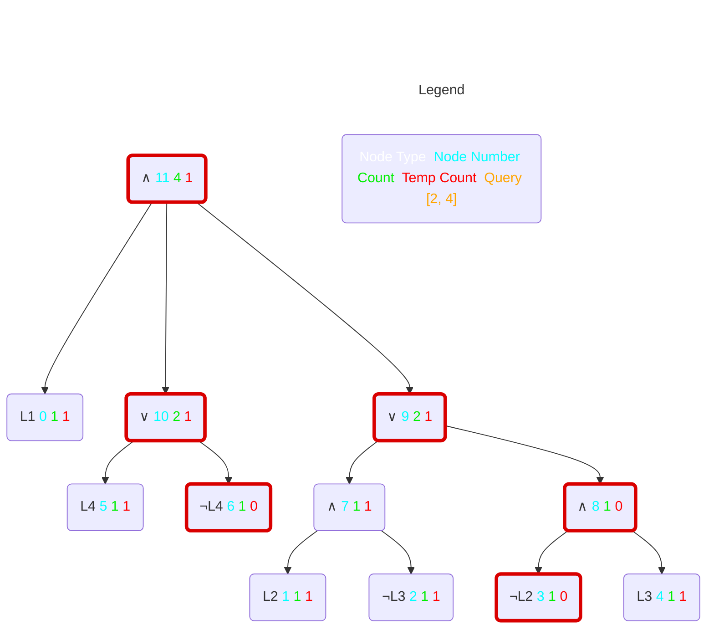

# ddnnife a d-dnnf-reasoner

ddnnife takes a smooth d-DNNF as an input following the [standard format specified by c2d](http://reasoning.cs.ucla.edu/c2d/) or a d-DNNF conforming to the [d4 standard](https://github.com/crillab/d4)(https://github.com/crillab/d4), which is an extension of the c2d standard. After parsing and storing the d-DNNF, ddnnife can be used to compute the cardinality of single features, all features, or partial configurations. Additionally, via the stream API, ddnnife can compute SAT queries, core/dead features, atomic sets, enumerate complete valid configurations, and produce uniform random samples. 

# Table of contents
1. [Building ](#building)
   - [Requirements for Building ](#building_req)
   - [Build the Binaries ](#building_bin)
     - [Both ](#building_both)
     - [ddnnife ](#building_ddnnife)
     - [dhone (dsharp preprocessor) ](#building_dhone)
2. [Usage ](#usage)
   - [Binary on the Command Line ](#usage_cl)
     - [Examples ](#usage_cl_ex)
   - [Stream API ](#building_stream)
     - [Examples ](#building_stream_ex)
   - [Create Documentation ](#docu)
   - [Run Tests ](#tests)
   - [Test Coverage ](#coverage)
3. [Docker Alternative ](#docker)
   - [Building ](#docker_build)
   - [Usage ](#docker_usage)

# Building <a name="building"></a>
In the following, we describe the process to compile ddnnife. As an alternative, we offer binaries of the major releases on the main branch as well as a [Dockerfile](#docker).

## Requirements for Building <a name="building_req"></a>

First, if not done already, you have to [install rust](https://www.rust-lang.org/tools/install). The recommended way is the following, using curl and rustup:
```properties
curl --proto '=https' --tlsv1.2 -sSf https://sh.rustup.rs | sh
```
After that, we recommend entering "1" to proceed with the installation (without customizations).

Additionally, we use rug for the computations. Make sure to install everything mentioned on rugs [crates.io page](https://crates.io/crates/rug) to use rug and our software. There it says:

*Rug [...] depends on the [GMP](https://gmplib.org/), [MPFR](https://www.mpfr.org/) and [MPC](https://www.multiprecision.org/mpc/) libraries through the low-level FFI bindings in the [gmp-mpfr-sys crate](https://crates.io/crates/gmp-mpfr-sys), which needs some setup to build; the [gmp-mpfr-sys documentation](https://docs.rs/gmp-mpfr-sys/1.4.7/gmp_mpfr_sys/index.html) has some details on usage under [different os][...].*

To build on GNU/Linux, make sure you have ```diffutils, gcc, m4``` and ```make``` installed on your system. For example on Ubuntu:
```properties
sudo apt-get update && apt-get install diffutils gcc m4 make
```

## Build the Binaries <a name="building_bin"></a>

Make sure that the current working directory is the one including the Cargo.toml file.
Building on systems that are not Linux x_86 like for instance apple m1/m2 is currently not possible directly.
As an alternative, you can use the provided [Dockerfile](#docker) to build yourself an image.

### Both <a name="building_both"></a>
```properties
cargo build --release
```

### ddnnife <a name="building_ddnnife"></a>
```properties
cargo build --release --bin ddnnife
```

### dhone (dsharp preprocessor) <a name="building_dhone"></a>
```properties
cargo build --release --bin dhone
```

# Usage <a name="usage"></a>
## Binary on the Command Line <a name="usage_cl"></a>
Simply execute the binaries with the -h, --help flag or no parameter at all to get an overview of all possible parameters and how to use them.

Note: In this and the following code examples, we added the ```./target/release/``` directories as a prefix because that's where the binaries are placed when building. They are built according to the previous chapter and the working directory is not switched.

Help for dhone
```properties
./target/release/dhone -h
```

and ddnnife
```properties
./target/release/ddnnife -h
```

### Examples <a name="usage_cl_ex"></a>
Prepossesses the d-DNNF: ```berkeleydb_dsharp.nnf``` which may need preprocessing because it was created with dsharp (in this case it is necessary) and save the resulting d-DNNF as ```berkeleydb_prepo.nnf```
```properties
./target/release/dhone example_input/berkeleydb_dsharp.nnf -s example_input/berkeleydb_prepo.nnf
```
Compute the cardinality of a feature model for ```auto1```.
```properties
./target/release/ddnnife example_input/auto1_c2d.nnf
```

Compute the cardinality of features for ```busybox-1.18.0_c2d.nnf``` and saves the result as ```busybox-features.csv``` in the current working directory.
```properties
./target/release/ddnnife example_input/busybox-1.18.0_c2d.nnf -c busybox
```

Compute the cardinality of features for ```auto1``` when compiled with d4. Here we need the ```-t``` Option that allows us to specify the total number of features. That information is needed but not contained in d-DNNFs using the d4 standard. Furthermore, the parsing takes more time because we have to smooth the d-DNNF. The results will be saved as ```auto1_d4_2513-features.csv```. (Note that for the example input the number of features is part of the file name for d4 models).
```properties
./target/release/ddnnife example_input/auto1_d4_2513.nnf -t 2513 -c
```

Compute the cardinality of features for ```auto1``` starting from a CNF file. Currently, the CNF file must be indicated by either the file ending ```.cnf``` or ```.dimacs```. We use the d4 compiler to generate a dDNNF which we can use in the following steps. The ```-t``` Option is not necessary, because the needed information if part of the CNF.
```properties
./target/release/ddnnife example_input/auto1.cnf -c
```

An alternative to the above, using the possibility to load a model via stdin.
```properties
cat example_input/auto1_d4_2513.nnf | ./target/release/ddnnife -p -t 2513 -c
```

Compute the cardinality of partial configurations for ```X264_c2d.nnf``` with 4 threads (default) and save the result as ```X264_c2d-queries.csv"```(default) in the current working directory (default).
```properties
./target/release/ddnnife example_input/X264_c2d.nnf -q example_input/X264.config
```

Compute 100 uniform random samples for the auto1 model for seed 42.
```properties
./target/release/ddnnife example_input/auto1_d4.nnf -t 2513 urs -n 100 -s 42
```

Compute the atomic sets for auto1.
```properties
./target/release/ddnnife example_input/auto1_d4.nnf -t 2513 atomic-sets
```

Display the help information for the sat command.
```properties
./target/release/ddnnife sat -h
```

Create the mermaid visualization of the small example dDNNF under assumptions. The model count is 4 and the count for the partial configuration (2,4) is 1.
```properties
./target/release/ddnnife example_input/small_example_c2d.nnf mermaid -a 2 4 
```



## Stream API <a name="building_stream"></a>
With the ```stream``` command, we introduce the possibility to interact with ddnnife via stdin and stdout. The user can choose between different kinds of queries that can be further adjusted with additional parameters. The idea behind the stream API is to interact with ddnnife with another program, but for testing purposes, one can use the stdin and stdout of a terminal to test the API.

We start ddnnife in stream mode for the ```automotive01``` model via
```properties
./target/release/ddnnife example_input/auto1_d4.nnf -t 2513 stream
```

From here on, we can use the following types of queries:
- ```count```: Computes the cardinality of a partial configuration
- ```core```: Lists core and dead features
- ```sat```: Computes if a partial configuration is satisfiable
- ```enum```: Lists complete satisfiable configurations
- ```random```: Gives uniform random samples (which are complete and satisfiable)
- ```atomic```: Computes atomic sets
- ```atomic-cross```: Computes atomic sets; a set can contain included and excluded features
- ```clause-update```: Manipulates the underlying CNF by adding / removing clauses and adjusting the total amount of features. Requires any change to be valid.
- ```undo-update```: Reverting the latest manipulation. Applying ```undo-update``` twice results in the second ```undo-update``` being equivalent to a redo.
- ```save-ddnnf```: Saves the d-DNNF for future use.
- ```save-cnf```: Saves the d-DNNF as CNF for future use; does require the input to be a CNF as well. Saving always persists the current version. Hence, this is especially intersting in combination with ```clause-update```.
- ```exit```: Leaves the stream mode

Furthermore, where sensible, the types of queries can be combined with the parameters:
- ```v variables```: The features we are interested in
- ```a assumptions```: Assignments of features to true or false
- ```l limit```: The number of solutions
- ```s seed```: Seeding for random operations
- ```p path```: The absolute path, for when we want to save the d-DNNF as d-DNNF or CNF.
- ```add```: Add something; currently only available for clauses
- ```rmv```: Remove something; currently only available for clauses
- ```t total-features```: Change the total amount of features. ```t total-features``` is always evaluated before ```add``` and ```rmv```.

The table below depicts the possible combinations of a query type with the parameters. The order of parameters does NOT influence the result and if two or more parameters are valid, then every possible combination of those is also valid.
Some parameters are optional and others are required. The usage should be intuitive. Otherwise, one can try and get an error message explaining what went wrong. The examples listed later serve as a guide.

| query type / parameter | variables | assumptions | limit | seed | path | add | rmv | total-features |
|------------------------|-----------|-------------|-------|------|------|-----|-----|----------------|
| count                  |     ✔     |      ✔      |       |      |      |     |     |                |
| core                   |     ✔     |      ✔      |       |      |      |     |     |                |
| sat                    |     ✔     |      ✔      |       |      |      |     |     |                |
| enum                   |           |      ✔      |   ✔   |   ✔  |      |     |     |                |
| random                 |           |      ✔      |   ✔   |   ✔  |      |     |     |                |
| atomic                 |     ✔     |      ✔      |       |      |      |     |     |                |
| atomic-cross           |     ✔     |      ✔      |       |      |      |     |     |                |
| clause-update          |           |             |       |      |      |  ✔  |  ✔  |       ✔        |
| undo-update            |           |             |       |      |      |     |     |                |
| save-ddnnf             |           |             |       |      |   ✔  |     |     |                |
| save-cnf               |           |             |       |      |   ✔  |     |     |                |
| exit                   |           |             |       |      |      |     |     |                |

Sub-solutions (like multiple uniform random samples) will be separated by a ```";"```. Intern a solution, the feature numbers are separated by a space. The end of an answer is indicated by a new line.

Syntactically wrong queries will result in an error message with an error code. The different error codes are: 
- ```E1``` Operation is not yet supported
- ```E2``` Operation does not exist. Neither now nor in the future
- ```E3``` Parse error
- ```E4``` Syntax error
- ```E5``` Operation was not able to be done, because of the wrong input
- ```E6``` File or path error

### Examples <a name="building_stream_ex"></a>
After entering the stream API, the following examples are conceivable but not exhaustive:


Check whether features 10, 100, and 1000 are either core or dead under the assumption that feature 1 is deselected.
```properties
core a -1 v 10 100 1000
```

Compute the cardinality of partial configuration for the configurations: [1, -4, -5, -6], [2, -4, -5, -6], and [3, -4, -5, -6].
```properties
count v 1 2 3 a -4 -5 -6
```

Similarly to count, we compute whether the partial configuration is satisfiable: [1, -4, -5, -6], [2, -4, -5, -6], and [3, -4, -5, -6].
```properties
sat v 1 2 3 a -4 -5 -6
```

Lists all possible complete and valid configurations, with feature 1 selected and feature 2 deselected, as long as there are some left. Each following call will result in configurations that were not yet computed as results. After all configurations were returned as a result, we start again at the beginning.
```properties
enum l 10 a 1 -2
```

Creates 10 uniform random samples with the seed 42. If neither ```l``` nor ```s``` is set, one uniform random sample will be created.

```properties
random l 1 s 42
```
Computes all atomic sets for the candidates ```v``` under the assumptions ```a```. If no candidates are supplied, all features of the d-DNNF will be the candidates.
```properties
atomic v 1 2 3 4 5 6 7 8 9 10 a 1
```

Adds two new features and a clause enforcing either on of the two new features to be selected.
```properties
clause-update t 44 add 43 44
```

Saves the nnf as smooth d-DNNF in the c2d format. The parameter ```p``` or ```path``` has to be set, and the path must be absolute.
```properties
save-ddnnf p /home/user/Documents/d-DNNFs/auto1.nnf
```

Exit the stream mode and terminate the ddnnife instance.
```properties
exit
```
## Create Documentation <a name="docu"></a>
Generates an Html file of the documentation and opens it in the default browser.
```properties
cargo doc --open
```

Besides the generated documentation, there are further comments in the code itself.

## Run Tests <a name="tests"></a>
We highly encourage also running test cases with the release build, because the debug build is very slow in comparison.
```properties
cargo test --release
```

## Test Coverage <a name="coverage"></a>
Test coverage can be determined with llvm-cov. llvm-cov is not included in rustup.
Make sure to execute the following commands in the folder that also contains the Cargo.toml file.

usage:
1) Install llvm-cov
2) Run tests. The results will be displayed in your default browser if the ```--open``` flag is set. Alternatively, the report will be printed on the console.
```properties
cargo +stable install cargo-llvm-cov
cargo llvm-cov --release --open
```

# Dockerfile <a name="docker"></a>
If natively building is not possible for your system, or you want to avoid installing the necessary dependencies, you can build yourself a docker image. Nevertheless, we recommend a native binary if possible.
## Building <a name="docker_build"></a>
You can either use the provided script in the following way to build the image and also interact with it
```properties
./ddnnife_dw.sh
```
or you can build the image directly by hand. Here, ```ddnnife``` is the name of the image.
```properties
docker build -t ddnnife .
```
## Usage <a name="docker_usage"></a>
Like in the previous section you can use ```./ddnnife_dw.sh``` to interact with the image or you can do the same by hand in with the following command:
```properties
docker run --platform linux/amd64 -i --rm -v [HOST FOLDER ABSOLUTE]:/data ddnnife
```
```--platform linux/amd64``` is necessary for host systems that are not ```linux x_86```, ```-i``` keeps STDIN open (which is relevant for the stream API), ```--rm``` removes the used container, and ```-v``` adds a volume to the container. [HOST FOLDER ABSOLUTE] is the folder on the host system that contains the input files for ```ddnnife```. ```ddnnife``` is the name of the image we created in the previous step.

After that arguments for ```ddnnife``` can be passed. It is important that to access the files mounted via the volume, you need to add the ```/data/``` prefix to all the input and output files. An example to compute the cardinality of features for ```auto1``` can look like the following.
```properties
docker run --platform linux/amd64 -i --rm -v ~/Documents/d-dnnf-reasoner/example_input:/data ddnnife /data/auto1.cnf count-features /data/result
```